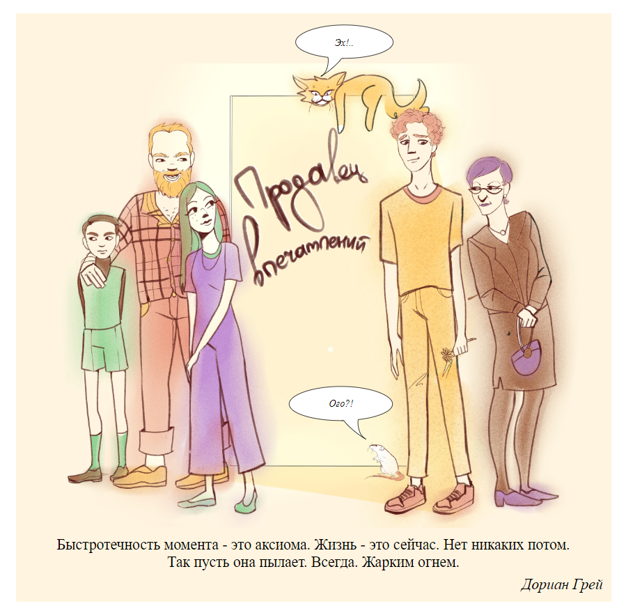
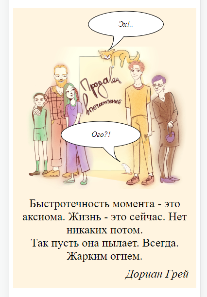
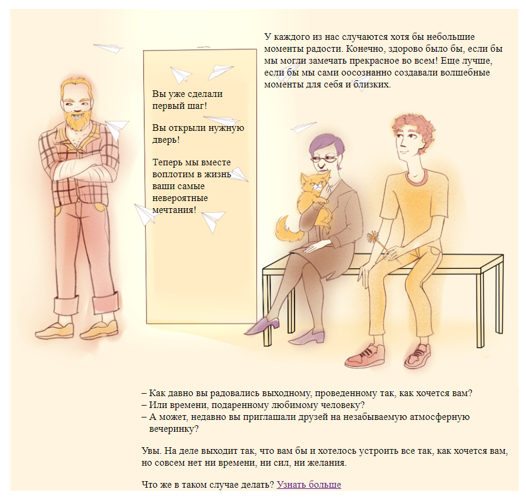
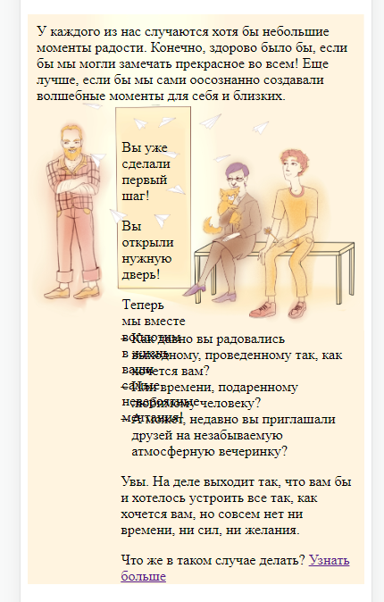

# Адрес сайта

[https://prodavets-vpechatleniy.ru/](https://prodavets-vpechatleniy.ru/)

# Структура сайта и макета

Макет сайта сделан по «экранам» в виде эскизов на бумаге. Не стоит думать, что это разные страницы – сайт представляет собой одну длинную страницу из этих «экранов». Есть немного дополнительных страниц, но о них тут пока речи не идет.

# Хостинг

Сайт пока статический, поэтому подойдет любой хостинг. Я разместил его на githubpages – это бесплатно. Когда потребуется добавить на сайт какие-нибудь формы для заполнения, отправку почты и т. д., надо будет воспользоваться платным хостингом.

Специально делать сайт на каком-нибудь конструкторе нет смысла – это усложнит реализацию сложных элементов дизайна.

Вот тут сейчас хостится сайт: [https://github.com/alex-kolesnikov/prodavets-vpechatleniy](https://github.com/alex-kolesnikov/prodavets-vpechatleniy)

# Отображение на узких экранах

Макеты и графика для сайта сделаны в расчете на «настольный» браузер и не адаптированы для отображения на мобильных устройствах. Необходимо придумать компоновку страниц для отображения на телефонах, а также «облегчить» графику (чтобы сайт грузился быстрее).

# Сложности верстки

В целом дизайн не типовой, много графики и много текстовых элементов, которые надо точно позиционировать поверх этой графики. Это и есть основная техническая сложность при разработке этого сайта.

Для десктопа стоит зафиксировать несколько размеров для отображения, и под них погонять позиционирование текста. Для узких экранов (для телефонов) контент будет растягиваемым, и поэтому там оформительство надо упрощать, иначе неминуемо что-то поедет.

Выбраны следующие контрольные точки:

- ширина окна меньше 576 – ширина сайта резиновая 100% окна, и вот это как раз для мобилок – тут надо верстать проще, использовать картинки с уже нарисованным текстом и т. д.;
- от 576 – ширина сайта 540;
- от 768 – ширина 720 (сюда попадают айпады и прочие планшеты),
- от 1200 – ширина 1140, и шире уже не становится.

Вообще, надо еще раз оценить, сколько там текста. Может быть, его действительно весь стоит нарисовать. А для индексации добавить его в alt. Останется спозиционировать только ссылки, которые достаточно компактные. Это значительно ускорит разработку сайта.

Еще один довод в пользу этого: картинки огромные, текст по сравнению с этим ничего не весит. Экономия на том, чтобы текст делать текстом, почти нулевая.

Минусы:

- текст невозможно будет выделить;
- возможно, будет хуже индексироваться поисковиками;
- возможно, текст будет выглядеть замыленным на телефонах из-за масштабирования картинки.

Видимо, стоит применять гибридный подход. Тот текст, что точно должен быть поверх элементов картинки, стоит рисовать. То, что сбоку/снизу и т. д. – делать текстом.

Еще один момент насчет «облачков» и прочих элементов для размещения текста на картинке – они должны быть уже прорисованы на картинке, сразу вместе с текстом. Они вызывают наибольшие сложности с позиционированием и масштабированием на маленьких экранах.

Пример, когда их нанесение «поверх» хорошо работает:

| декстоп | мобилка |
| ------- | ------- |
|  |  |

Пример, когда это плохо работает:

| декстоп | мобилка |
| ------- | ------- |
|  |  |

# Главная страница

## Экран 1

## Экран 2

## Экран 3
