- [Общая информация](#общая-информация)
- [Структура сайта и макета](#структура-сайта-и-макета)
- [Хостинг](#хостинг)
- [Дизайн и верстка](#дизайн-и-верстка)
  - [Отображение на узких экранах](#отображение-на-узких-экранах)
  - [Сложности верстки](#сложности-верстки)
  - [Шрифт](#шрифт)
  - [Обрамление картинок, переход в цвет фона](#обрамление-картинок-переход-в-цвет-фона)
  - [Обрамление экранов](#обрамление-экранов)
- [Главная страница](#главная-страница)
  - [Экран 1](#экран-1)
  - [Экран 2](#экран-2)
  - [Экран 3](#экран-3)
  - [Экран 4](#экран-4)
  - [Экран 5](#экран-5)
  - [Экран 6](#экран-6)
  - [Экран 7](#экран-7)
  - [Экран 8](#экран-8)
  - [Экран 9](#экран-9)
  - [Экран 10](#экран-10)
  - [Экран 11](#экран-11)
  - [Экран 12](#экран-12)
  - [Экран 13](#экран-13)

# Общая информация
Это техзадание на разработку сайта.

Есть набор эскизов в карандаше. По ним уже отрисована графика, но не вся и не в окончательном варианте.
Здесь разобрано, как можно все это довести до работающего варианта.

Адрес сайта: [https://prodavets-vpechatleniy.ru/](https://prodavets-vpechatleniy.ru/)

# Структура сайта и макета

Макет сайта сделан по «экранам» в виде эскизов на бумаге. Не стоит думать, что это разные страницы – сайт представляет собой одну длинную страницу из этих «экранов». Есть немного дополнительных страниц, но о них тут пока речи не идет.

# Хостинг

Сайт пока статический, поэтому подойдет любой хостинг. Я разместил его на githubpages – это бесплатно. Когда потребуется добавить на сайт какие-нибудь формы для заполнения, отправку почты и т. д., надо будет воспользоваться платным хостингом.

Специально делать сайт на каком-нибудь конструкторе нет смысла – это усложнит реализацию сложных элементов дизайна.

Вот тут сейчас хостится сайт: [https://github.com/alex-kolesnikov/prodavets-vpechatleniy](https://github.com/alex-kolesnikov/prodavets-vpechatleniy)

# Дизайн и верстка

## Отображение на узких экранах

Макеты и графика для сайта сделаны в расчете на «настольный» браузер и не адаптированы для отображения на мобильных устройствах. Необходимо придумать компоновку страниц для отображения на телефонах, а также «облегчить» графику (чтобы сайт грузился быстрее).

## Сложности верстки

В целом дизайн не типовой, много графики и много текстовых элементов, которые надо точно позиционировать поверх этой графики. Это и есть основная техническая сложность при разработке этого сайта.

Для десктопа стоит зафиксировать несколько размеров для отображения, и под них погонять позиционирование текста. Для узких экранов (для телефонов) контент будет растягиваемым, и поэтому там оформительство надо упрощать, иначе неминуемо что-то поедет.

Я выбрал следующие контрольные точки:

- ширина окна меньше 576 – ширина сайта резиновая 100% окна, и вот это как раз для мобилок – тут надо верстать проще, использовать картинки с уже нарисованным текстом и т. д.;
- от 576 – ширина сайта 540 - это что-то среднее между телефонами и планшетами, и пока не знаю, как тут верстать и надо ли что-то делать по сравнению с первым вариантом;
- от 768 – ширина 720 - сюда попадают айпады и прочие планшеты;
- от 1200 – ширина 1140, и шире уже не становится - это для мониторов; по сравнению с предыдущим вариантом, тут могут быть шрифты побольше.

Вообще, надо еще раз оценить, сколько там текста. Может быть, его действительно весь стоит нарисовать. А для индексации добавить его в alt. Останется спозиционировать только ссылки, которые достаточно компактные. Это значительно ускорит разработку сайта.

Еще один довод в пользу этого: картинки огромные, текст по сравнению с этим ничего не весит. Экономия на том, чтобы текст делать текстом, почти нулевая.

Минусы:

- текст невозможно будет выделить;
- возможно, будет хуже индексироваться поисковиками;
- возможно, текст будет выглядеть замыленным на телефонах из-за масштабирования картинки.

Видимо, стоит применять гибридный подход. Тот текст, что точно должен быть поверх элементов картинки, стоит рисовать. То, что сбоку/снизу и т. д. – делать текстом.

Еще один момент насчет «облачков» и прочих элементов для размещения текста на картинке – они должны быть уже прорисованы на картинке, сразу вместе с текстом. Они вызывают наибольшие сложности с позиционированием и масштабированием на маленьких экранах.

Пример, когда их нанесение «поверх» хорошо работает:

| декстоп | мобилка |
| ------- | ------- |
|  |  |

Пример, когда это плохо работает:

| декстоп | мобилка |
| ------- | ------- |
|  |  |

## Шрифт
Вроде бы выбирали уже какой-то, надо освежить информацию.

## Обрамление картинок, переход в цвет фона
Сейчас можно видеть, что граница картинки может быть градиентной, и поэтому она видна на фоне страницы. Надо или всю графику делать одного цвета по краям, или считать это нормой.
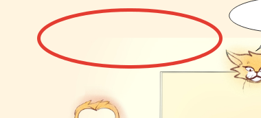

## Обрамление экранов
Вроде говорили о том, что была разработана какая-то графика, разделяющая экраны. Надо ее найти.

# Главная страница
Дальше по экранам будут приведены:
- эскизы
- та графика, что уже отрисована
- комментарии по необходимым правкам

## Экран 1

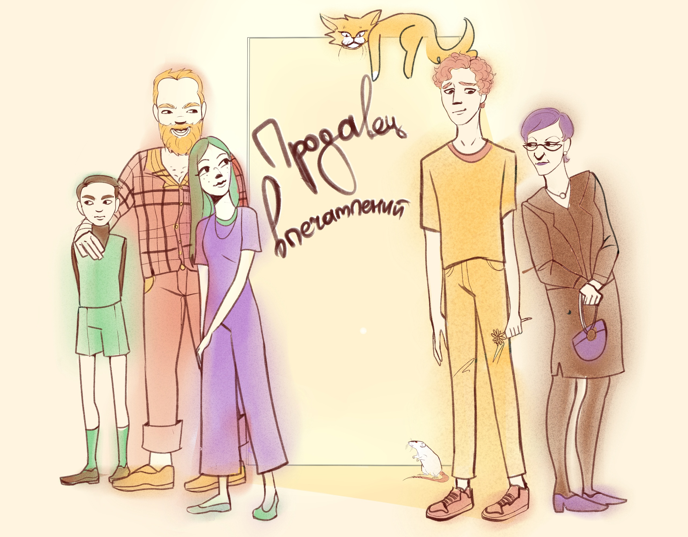

Вот это облачко (и второе тоже) надо рисовать сразу на картинке:

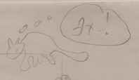

## Экран 2

Как выглядит сейчас:

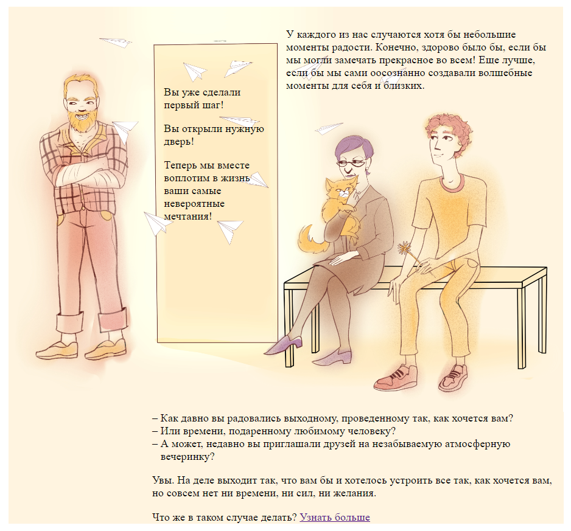

Для мобильной версии это надо разделить, и порядок блоков будет таким:

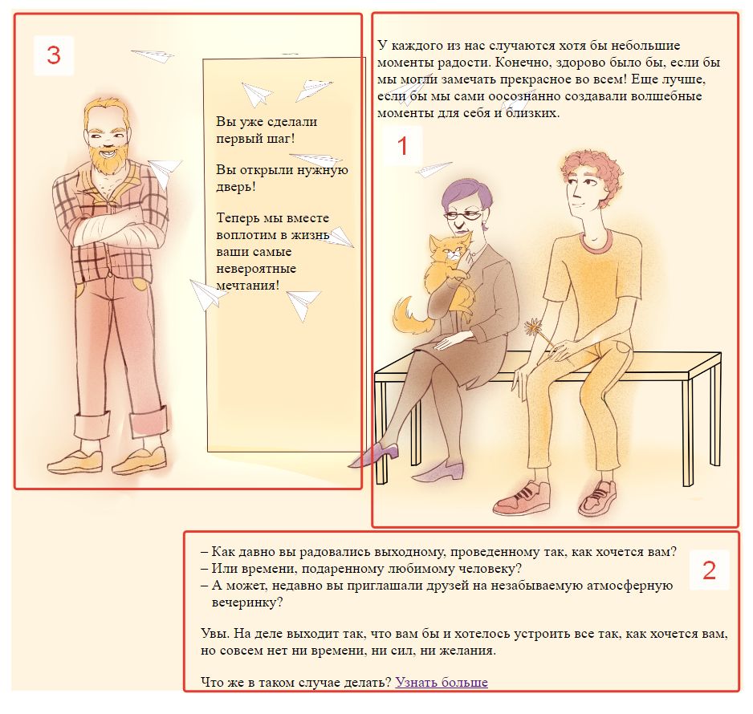

## Экран 3

## Экран 4
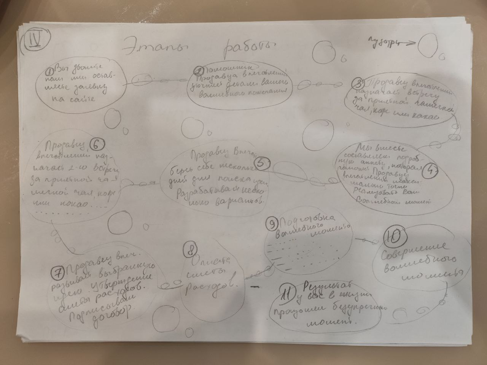

## Экран 5
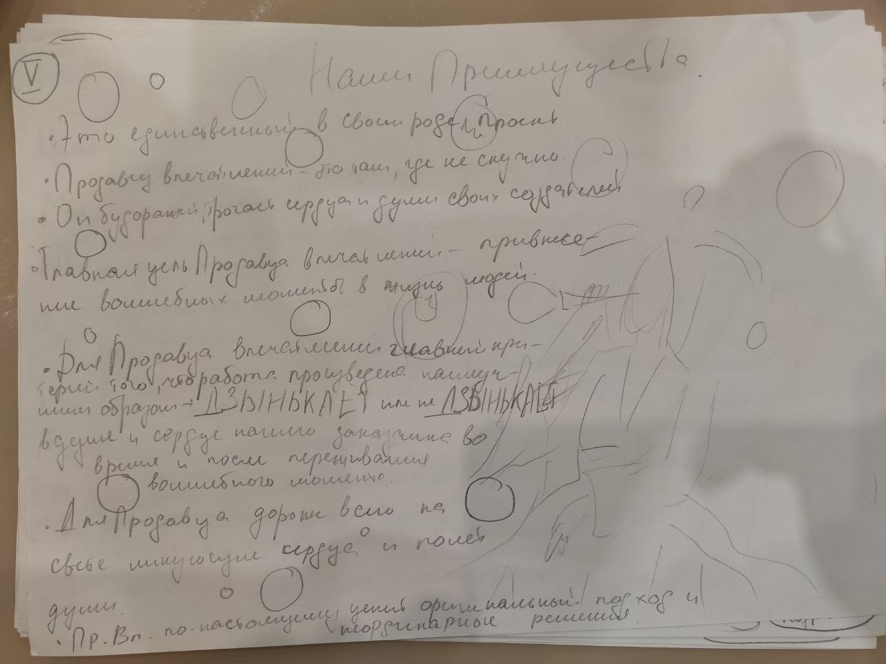

## Экран 6
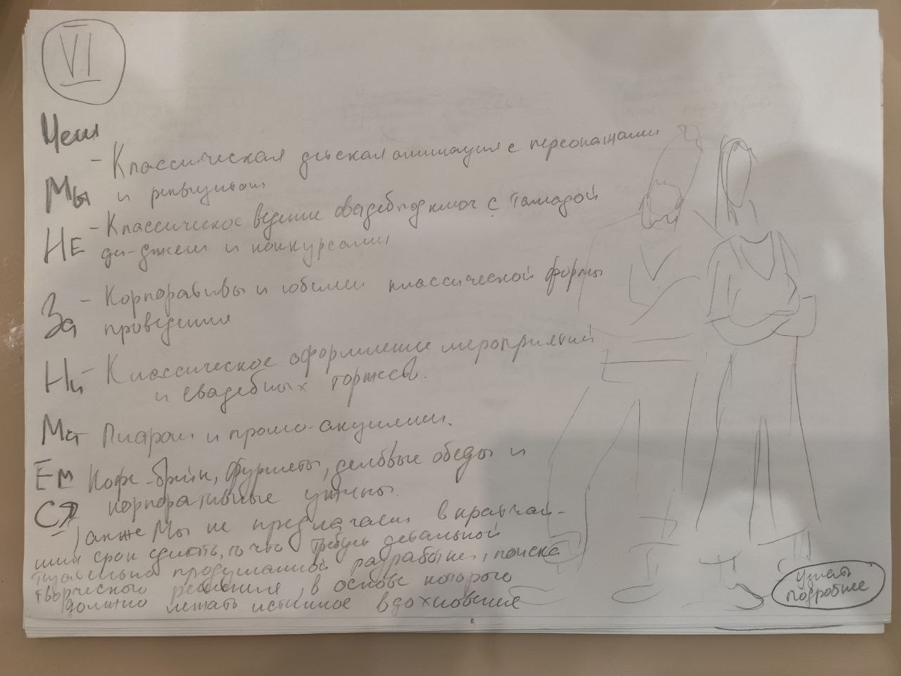

## Экран 7
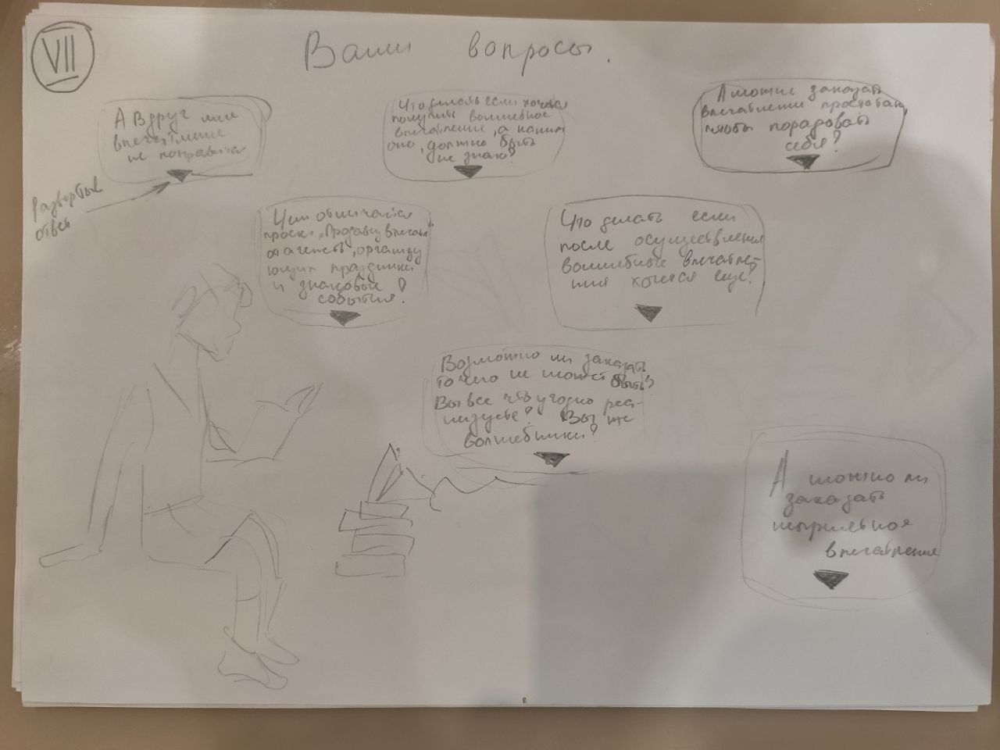

## Экран 8

## Экран 9
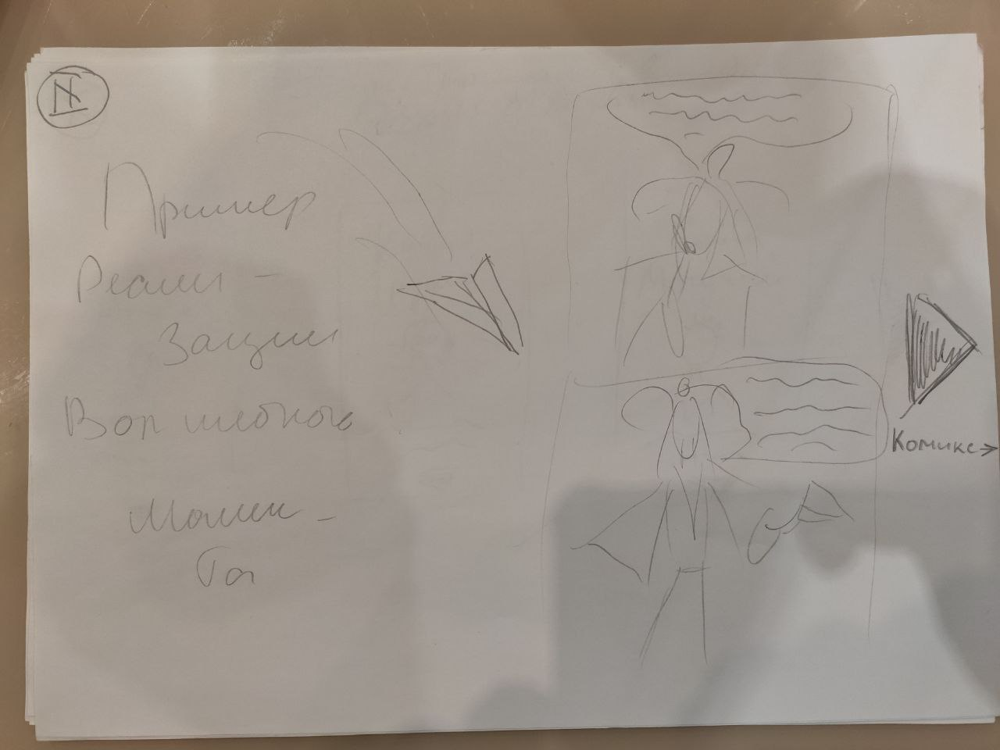

## Экран 10
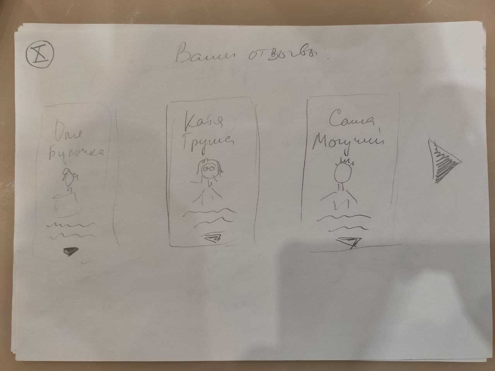

## Экран 11
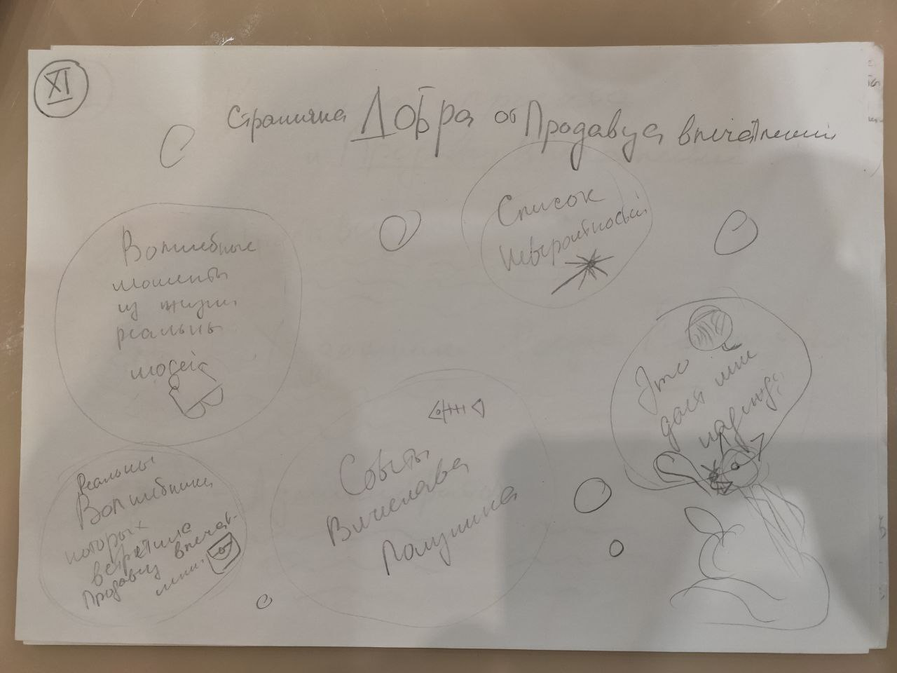

## Экран 12
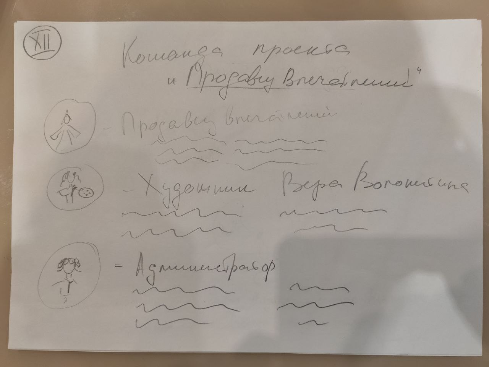

## Экран 13

